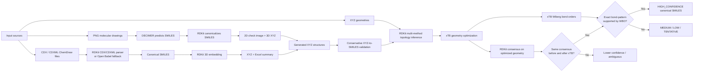
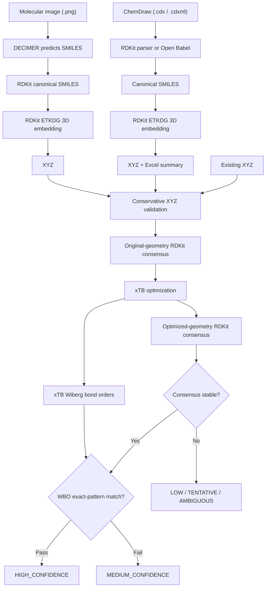
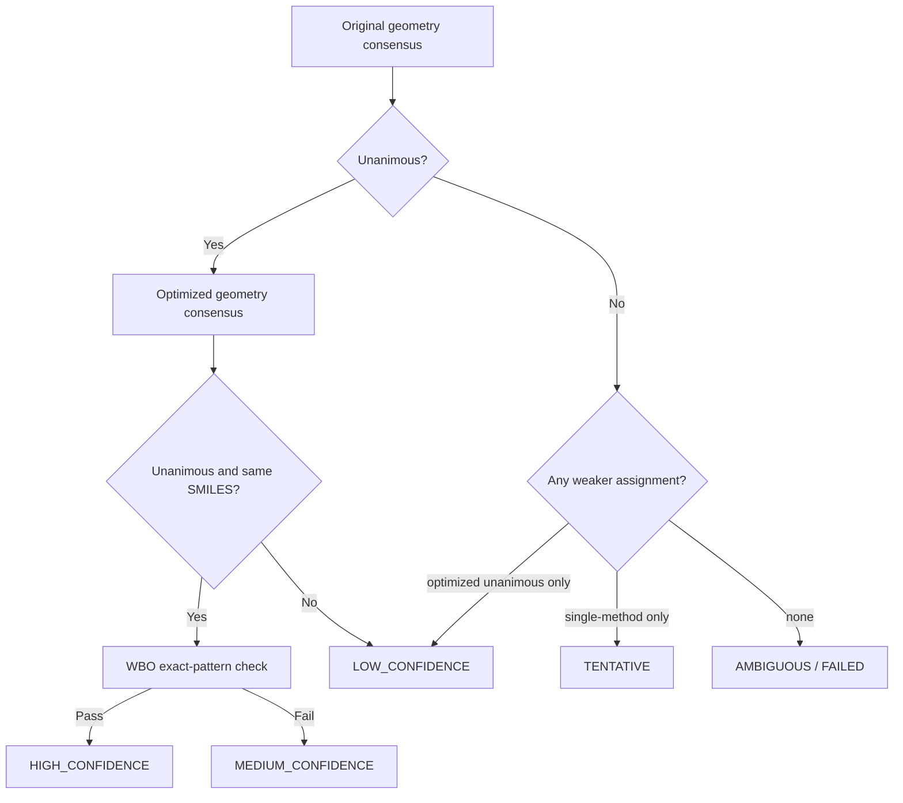

[README.md](https://github.com/user-attachments/files/27039115/README.md)
# Publication Companion Repository: Molecular Structure Recovery, 3D Generation, and Conservative Validation

<p align="center">
  
  
  
  
  
  
  
</p>

> **Companion repository for a paper / methods publication** on recovering molecular structures from images and ChemDraw files, generating 3D XYZ coordinates, and conservatively validating canonical SMILES assignments from geometry.
>
> **One-line summary:** this repository contains **three standalone but complementary workflows**: **(1)** molecular image → SMILES/XYZ via DECIMER + RDKit, **(2)** ChemDraw CDX/CDXML → SMILES/XYZ/Excel via RDKit/Open Babel + RDKit, and **(3)** XYZ → canonical isomeric SMILES using **multi-method RDKit consensus**, **xTB geometry refinement**, and **exact-pattern Wiberg bond-order verification**. These workflows can be used independently or chained manually in a publication pipeline.

---

## Why this repository exists

Molecular structures often originate from heterogeneous sources:

- **chemical drawings in raster images**,
- **ChemDraw-native CDX/CDXML documents**,
- **3D XYZ coordinate files** from computational or curated workflows.

Each representation captures a different layer of chemical information, and each introduces its own failure modes. Optical recognition may misread bonds, document parsers may depend on backend support, and geometry-based graph reconstruction can become unstable for aromatic, distorted, or ambiguous systems.

This repository is designed as a **publication-oriented, traceable set of workflows** for converting and validating structures across these representations. Instead of relying on a single permissive conversion step, it emphasizes:

- **cross-representation recovery**,
- **canonicalization and coordinate generation**,
- **multi-method agreement checks**,
- **geometry refinement and bond-order verification**, and
- **transparent outputs suitable for benchmark datasets and supplementary information**.

---

## Graphical abstract



---

## Repository scope

This repository brings together three **standalone scripts** that can be presented as a unified methodological framework in a paper. They are not wired together as one automatic end-to-end executable pipeline; instead, outputs from one workflow can be passed manually into another when needed:

### 1) `buildingmolecule.py`
**Purpose:** convert molecular structure images (`.png`) into predicted SMILES, canonicalize them, draw recognized structures, and generate 3D XYZ coordinates.

Core stages:
- DECIMER optical chemical structure recognition
- RDKit SMILES parsing and canonicalization
- RDKit 2D rendering for visual verification
- RDKit ETKDG-based 3D coordinate generation
- MMFF/UFF geometry optimization when available

### 2) `cdx_to_smiles_xyz_excel_folder_v5.py`
**Purpose:** batch-convert ChemDraw files (`.cdx`, `.cdxml`) into canonical SMILES, 3D XYZ files, and an Excel summary table.

Core stages:
- RDKit CDX/CDXML parsing when supported
- Open Babel fallback when RDKit cannot parse a file
- RDKit canonical isomeric SMILES generation
- RDKit ETKDG 3D embedding
- Excel export of filename–SMILES mappings

### 3) `xtb_rdkit_high_confidence_smiles_v3.py`
**Purpose:** assign conservative, confidence-ranked canonical SMILES from XYZ files using agreement across RDKit methods and xTB-supported Wiberg bond-order verification.

Core stages:
- multiple RDKit topology construction routes
- unanimous-consensus requirement
- xTB geometry optimization
- xTB Wiberg bond-order extraction
- exact-pattern bond-class verification
- strict confidence ladder

---

## Combined workflow concept



This diagram shows the **conceptual way the three scripts can be combined** in a study or dataset workflow. In practice, the repository currently exposes them as separate command-line programs, so movement from one stage to another is done by passing files between scripts rather than by one master orchestrator.

---

## Highlights

- **Three-entry-point repository** for image-based, ChemDraw-based, and XYZ-based structure processing, with manual handoff possible between workflows.
- **Publication-oriented design** with reproducible outputs, summaries, and visual cross-checks, while acknowledging that traceability depth differs across the three scripts.
- **Conservative validation policy** for geometry-derived SMILES rather than single-pass assignment.
- **Fallback parsing strategy** for ChemDraw inputs via RDKit first, Open Babel second.
- **Recognized structure images** generated from predicted SMILES for manual review.
- **Excel and CSV summaries** for downstream benchmarking or supplementary tables.
- **Parallel execution** in the xTB workflow with thread-based scheduling to avoid common Windows RDKit/MKL multiprocessing failures.

---

## Workflow 1: Molecular image → SMILES → XYZ

### What the image pipeline does

The image-processing script is designed for optical chemical structure recognition (OCSR) from PNG files.

For each input image:

1. **DECIMER** predicts a SMILES string from the structure drawing.
2. **RDKit** parses the predicted SMILES.
3. The script computes a **canonical SMILES** representation.
4. A **2D check image** is generated from the recognized structure.
5. RDKit adds hydrogens and embeds the molecule in 3D using **ETKDGv3**.
6. A force-field optimization is attempted with **MMFF** or **UFF**.
7. The molecule is written to an **XYZ** file.
8. A `results.csv` summary is generated.

### Outputs

```text
molecule/
├── *.png
├── results.csv
├── recognized/
│   └── *_recognized.png
└── xyz/
    └── *.xyz
```

### Why this matters in a paper

This part of the repository supports a workflow where the starting point is not structured chemical data, but **figure panels, scanned drawings, or manually created structure images**. The recognized 2D check images and `results.csv` file provide an important traceability layer for supplementary materials.

---

## Workflow 2: ChemDraw CDX/CDXML → SMILES → XYZ → Excel

### What the ChemDraw pipeline does

The ChemDraw conversion script batch-processes `.cdx` and `.cdxml` files and tries two parsing routes:

1. **RDKit native parser**, when the installed RDKit build exposes the necessary ChemDraw functionality.
2. **Open Babel fallback**, when RDKit parsing fails or lacks CDX/CDXML support.

For each successfully parsed molecule, the script:

- removes explicit hydrogens for canonicalization,
- generates **canonical isomeric SMILES**,
- adds hydrogens for 3D embedding,
- uses **ETKDGv3** for coordinate generation,
- runs MMFF or UFF optimization if possible,
- writes the structure to an **XYZ** file, and
- records the filename–SMILES mapping in an **Excel spreadsheet**.

### Outputs

```text
converted_output/
├── smiles_results.xlsx
└── xyz/
    └── *.xyz
```

### Why this matters in a paper

ChemDraw documents are common sources for curated chemical structures in laboratory and publication workflows. This pipeline turns document-native chemistry into machine-readable formats while preserving a clean tabular output for dataset assembly and reporting. Compared with the image and xTB workflows, however, its audit trail is lighter: the Excel output records filename–SMILES pairs, while parser choice and file-level failures are primarily reported to the console rather than embedded in the spreadsheet.

---

## Workflow 3: Conservative XYZ → canonical SMILES validation

### What the geometry-validation pipeline does

The XYZ validation script is intentionally strict. It is designed not just to convert coordinates into graphs, but to determine when that conversion is sufficiently stable to support a **high-confidence canonical SMILES assignment**.

For each XYZ file:

1. the input geometry is normalized and validated,
2. multiple **independent RDKit topology-generation methods** are attempted,
3. consensus on the **original geometry** is determined,
4. the geometry is optimized with **xTB**,
5. the optimized geometry is processed again with the same RDKit consensus logic,
6. **xTB Wiberg bond orders** are extracted,
7. the optimized RDKit topology is checked bond-by-bond against the xTB-inferred pattern, and
8. the molecule is assigned a confidence class.

### Multi-method RDKit topology generation

The script tries several routes, including:

- `DetermineBonds_ctd`
- `DetermineBonds_covF_1.25`
- `Connectivity_ctd_then_BondOrders`
- `Connectivity_covF_1.25_then_BondOrders`

It can also use:
- VdW-based variants when supported by the RDKit build
- Hückel-based variants when available

### Unanimous-agreement rule

A geometry reaches **unanimous consensus** only when:

- at least **two independent methods succeed**,
- **all attempted methods succeed**, and
- all successful methods return the **same canonical isomeric SMILES**.

### xTB refinement and WBO verification

The default design separates:
- **GFN-FF** for geometry optimization, and
- **GFN2-xTB** single-point calculation for Wiberg bond orders.

The Wiberg stage is stricter than a broad “compatible bond-order interval” check. Instead, it requires:

- support for every RDKit bond,
- explicit aromatic-ring consistency,
- mapping of WBOs to discrete bond classes,
- exact class agreement with the unanimous optimized RDKit topology,
- rejection of unexpected strong xTB-supported non-RDKit bonds.

---

## Confidence ladder



### Output classes

| Status | Meaning |
|---|---|
| `HIGH_CONFIDENCE` | Original and optimized geometries both reach unanimous RDKit consensus, both agree on the same SMILES, and xTB WBO exact-pattern verification passes. |
| `MEDIUM_CONFIDENCE` | Original and optimized geometries agree unanimously on the same SMILES, but WBO exact-pattern verification does not pass. |
| `LOW_CONFIDENCE` | A usable unanimous consensus exists for only one geometry view, or the two geometry views do not support the same final consensus. |
| `TENTATIVE` | A SMILES exists, but only from a weaker single-method result without multi-method consensus. |
| `AMBIGUOUS` | Evidence is insufficient or conflicting for a reliable assignment. |
| `FAILED` | Invalid input, xTB failure, or unrecoverable technical failure. |

---

## Suggested repository layout

```text
.
├── README.md
├── buildingmolecule.py
├── cdx_to_smiles_xyz_excel_folder_v5.py
├── xtb_rdkit_high_confidence_smiles_v3.py
├── environment.yml                     # recommended
├── requirements.txt                    # optional
├── data/
│   ├── molecule_images/
│   ├── chemdraw_files/
│   └── xyz_inputs/
├── outputs/
│   ├── image_pipeline/
│   │   ├── results.csv
│   │   ├── recognized/
│   │   └── xyz/
│   ├── chemdraw_pipeline/
│   │   ├── smiles_results.xlsx
│   │   └── xyz/
│   └── validation_pipeline/
│       ├── summary.csv
│       ├── optimized_xyz/
│       └── logs/
├── paper/
│   ├── manuscript.pdf                  # optional
│   ├── supplementary_information.pdf   # optional
│   └── figures/                        # optional
└── examples/                           # recommended
```

---

## Installation

### Suggested software environment

- Python **3.10+**
- **RDKit**
- **xTB**
- **pandas**
- **DECIMER** (for the image workflow)
- **Open Babel** (recommended for CDX/CDXML fallback parsing)

### Example conda setup

```bash
conda create -n mol-pipeline python=3.10 -y
conda activate mol-pipeline
conda install -c conda-forge rdkit xtb pandas openbabel -y
pip install decimer
```

> Depending on platform and package availability, DECIMER installation may require a separate environment or additional ML dependencies. The commands above are a **suggested starting environment**, not a fully code-verified lockfile. For publication use, freeze the exact environment with `environment.yml`, an explicit package export, or a container recipe.

---

## Quick start

### A) PNG molecular drawings → SMILES / recognized PNG / XYZ

```bash
python buildingmolecule.py
```

Default input folder in the script:

```text
molecule/
```

### B) ChemDraw CDX/CDXML → XYZ + Excel of canonical SMILES

```bash
python cdx_to_smiles_xyz_excel_folder_v5.py needtoconvertxyzandsmile -o converted_output
```

Optional explicit Open Babel executable path:

```bash
python cdx_to_smiles_xyz_excel_folder_v5.py needtoconvertxyzandsmile -o converted_output --obabel "C:\Path\To\obabel.exe"
```

### C) XYZ → conservative canonical SMILES validation

```bash
python xtb_rdkit_high_confidence_smiles_v3.py all -o xtb_rdkit_results
```

Representative options:

```bash
python xtb_rdkit_high_confidence_smiles_v3.py all \
  -o xtb_rdkit_results \
  --charge 0 \
  --opt-level normal \
  --opt-method gfnff \
  --gfn 2 \
  --acc 2.0 \
  --cycles 2000 \
  --scc-iterations 2500 \
  --jobs 8 \
  --xtb-threads 1 \
  --skip-existing
```

---

## Outputs at a glance

### Image pipeline
- `results.csv`
- recognized 2D structure PNGs
- XYZ files

### ChemDraw pipeline
- `smiles_results.xlsx`
- XYZ files

### Validation pipeline
- `summary.csv`
- optimized XYZ files
- xTB logs

These outputs make the repository suitable for a paper because the **raw inputs, intermediate representations, and final decisions can be archived and inspected**. The traceability is strongest in the image and xTB workflows; the ChemDraw workflow is more lightweight unless you separately capture console logs.

---

## Reproducibility notes

For a publication repository, consider including:

- a pinned `environment.yml`,
- representative input examples for all three workflows,
- archived outputs used for the paper,
- benchmark or failure-case examples,
- a `CITATION.cff` file,
- a software license,
- and links to the manuscript, preprint, or supplementary data.

### Suggested checklist

- [ ] Replace the repository title with the exact paper title.
- [ ] Add authors, affiliations, and ORCID links.
- [ ] Add DOI and Zenodo badges.
- [ ] Freeze the exact software environment.
- [ ] Add example data and expected outputs.
- [ ] Archive benchmark tables and logs.
- [ ] Add `CITATION.cff`.
- [ ] Add a license.

---

## Interpreting the methodological contribution

This repository is strongest as a **methods companion** when framed around the following ideas:

- **Cross-format molecular structure recovery** from images, ChemDraw files, and XYZ geometries.
- **Traceable conversion pathways** rather than black-box one-step translation, while noting that not every workflow persists the same amount of provenance metadata.
- **Conservative confidence assignment** for geometry-derived SMILES.
- **Human-checkable intermediates**, including recognized structure PNGs, XYZ outputs, CSV summaries, and Excel mappings.
- **Practical parser robustness**, using RDKit where possible and Open Babel where necessary.

This framing works well for:
- a cheminformatics methods paper,
- a benchmark dataset repository,
- a supplementary-code repo for a manuscript,
- or a workflow repository accompanying a thesis chapter.

---


## Limitations

- DECIMER predictions depend on image quality and drawing conventions.
- CDX parsing can depend on RDKit build support; Open Babel may be needed.
- ETKDG + force-field optimization produces useful 3D coordinates, but not necessarily quantum-optimized geometries.
- The conservative XYZ validation stage may classify chemically plausible cases as `AMBIGUOUS` by design.
- Thresholds and aromaticity logic in the WBO verification step should be described explicitly in any benchmark paper.

---

## Acknowledgments

This workflow builds on:
- **DECIMER** for optical chemical structure recognition
- **RDKit** for cheminformatics parsing, canonicalization, depiction, and coordinate generation
- **xTB** for geometry optimization and Wiberg bond-order analysis
- **Open Babel** for interoperability with ChemDraw-derived inputs

Please cite the upstream projects appropriately in any derivative publication.

---

## Maintainer note

This README is intentionally written in a **paper companion** style. To finalize it for a live repository, replace the placeholder title, citation entries, URLs, and badges with the exact metadata for your manuscript and archive.
