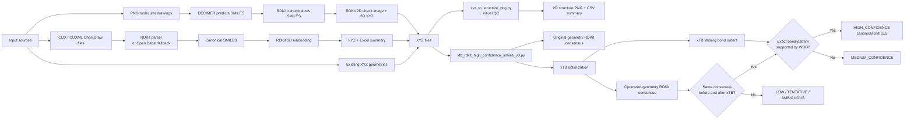
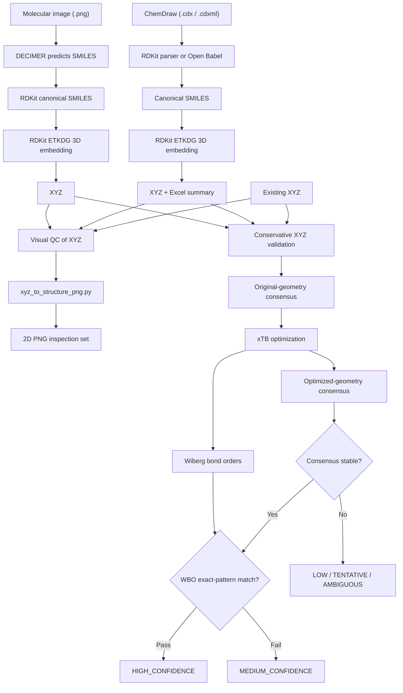
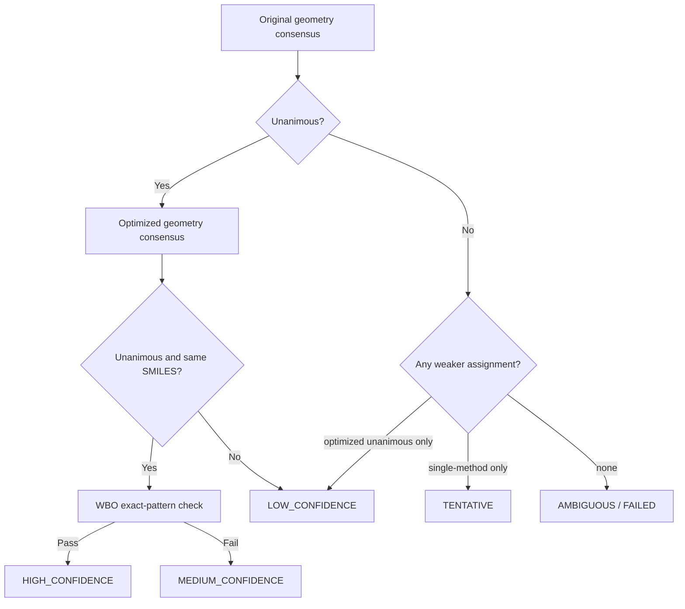

[README.md](https://github.com/user-attachments/files/27039520/README.md)
# Publication Companion Repository: Cross-Format Molecular Structure Recovery, XYZ Generation, Visual QC, and Conservative Validation

<p align="center">
  
  
  
  
  
  
  
  
</p>

> **Companion repository ** on recovering molecular structures from images, ChemDraw files, and XYZ coordinates; generating 3D structures; visually inspecting coordinate-derived structures; and assigning conservative confidence-ranked canonical SMILES from geometry.
>
> **One-line summary:** this repository contains **four standalone but complementary workflows**: **(1)** molecular image → SMILES/XYZ via DECIMER + RDKit, **(2)** ChemDraw CDX/CDXML → SMILES/XYZ/Excel via RDKit/Open Babel + RDKit, **(3)** XYZ → 2D structure PNG for rapid visual inspection, and **(4)** XYZ → confidence-ranked canonical isomeric SMILES using **multi-method RDKit consensus**, **xTB geometry refinement**, and **exact-pattern Wiberg bond-order verification**. These workflows can be run independently or chained manually in a publication pipeline.

---

## Why this repository exists

Molecular structure data often moves between different representations:

- **structure drawings in raster images**,
- **ChemDraw-native CDX/CDXML files**,
- **3D XYZ coordinates**, and
- **human-readable 2D depictions** used to inspect whether coordinate-derived structures look chemically plausible.

Each representation introduces different risks. Optical recognition may misread bonds, document parsers may depend on optional backend support, 3D embedding can create geometries that should be checked, and graph reconstruction from XYZ files can become unstable for aromatic, distorted, or ambiguous systems.

This repository is designed as a **publication-oriented set of interoperable scripts** for moving across those representations while retaining interpretable intermediate outputs. Instead of relying on one opaque conversion step, it emphasizes:

- **cross-format molecular structure recovery**,
- **canonicalization and 3D coordinate generation**,
- **visual quality control of XYZ-derived structures**,
- **multi-method agreement checks**, and
- **strict geometry-based validation using xTB and Wiberg bond orders**.

---

## Graphical abstract



---

## Repository scope

This repository brings together **four standalone scripts** that can be presented as one methodological framework. They are **not wired together as a single orchestrated executable pipeline**. Instead, outputs from one workflow can be passed manually into another when needed.

### 1) `buildingmolecule.py`
**Purpose:** convert molecular structure images (`.png`) into predicted SMILES, canonicalize them, draw recognized structures, and generate 3D XYZ coordinates.

Core stages:
- DECIMER optical chemical structure recognition
- RDKit SMILES parsing and canonicalization
- RDKit 2D rendering for visual verification
- RDKit ETKDG-based 3D coordinate generation
- MMFF/UFF optimization when available

### 2) `cdx_to_smiles_xyz_excel_folder_v5.py`
**Purpose:** batch-convert ChemDraw files (`.cdx`, `.cdxml`) into canonical SMILES, 3D XYZ files, and an Excel summary table.

Core stages:
- RDKit CDX/CDXML parsing when supported
- Open Babel fallback when RDKit cannot parse a file
- RDKit canonical isomeric SMILES generation
- RDKit ETKDG 3D embedding
- Excel export of filename–SMILES mappings

### 3) `xyz_to_structure_png.py`
**Purpose:** convert `.xyz` files into 2D structure PNGs for **rapid visual inspection**.

Core stages:
- RDKit XYZ parsing
- RDKit `DetermineBonds` connectivity and bond-order inference
- sanitization
- 2D coordinate generation
- PNG export
- CSV summary generation

### 4) `xtb_rdkit_high_confidence_smiles_v3.py`
**Purpose:** assign conservative, confidence-ranked canonical SMILES from XYZ files using agreement across multiple RDKit topology methods and xTB-supported Wiberg bond-order verification.

Core stages:
- multiple RDKit topology construction routes
- unanimous-consensus requirement
- xTB geometry optimization
- xTB Wiberg bond-order extraction
- exact-pattern bond-class verification
- strict confidence ladder

---

## Combined workflow concept



This diagram shows the **conceptual way the four scripts can be combined** in a study or dataset workflow. In practice, the repository currently exposes them as separate command-line programs, so movement from one stage to another is done by passing files between scripts rather than by one master orchestrator.

The arrows therefore represent **file handoff between scripts**, not an already-implemented orchestration layer inside the repository.

---

## Highlights

- **Four-entry-point repository** for image-based, ChemDraw-based, XYZ-based, and XYZ-visualization workflows.
- **Publication-oriented design** with intermediate files that can be inspected, archived, and cited in supplementary material.
- **Visual QC path for XYZ files** using `xyz_to_structure_png.py`, which is especially useful for checking whether generated or optimized coordinates lead to plausible 2D structures.
- **Conservative validation policy** for geometry-derived SMILES rather than single-pass assignment.
- **Fallback parsing strategy** for ChemDraw inputs via RDKit first and Open Babel second.
- **Recognized structure images, PNG inspection outputs, CSV summaries, and Excel mappings** for downstream review.
- **Parallel execution** in the xTB workflow with thread-based scheduling to avoid common Windows RDKit/MKL multiprocessing failures.

---
## Code-to-README validation note

This README has been checked against the current scripts in the repository and is intended to stay close to what the code actually does.

A few boundaries are important:

- the repository currently exposes **four standalone command-line scripts**, not one fully automated master pipeline;
- the combined diagrams below are therefore **conceptual workflow views**, showing how outputs can be passed manually from one script to another;
- the **visual QC** script (`xyz_to_structure_png.py`) is useful for inspection, but it is **not** equivalent to the stricter consensus + xTB validation workflow; and
- the software setup section is a **suggested working environment**, not a frozen or universally verified lockfile.

---


## Workflow 1: Molecular image → SMILES → XYZ

### What the image pipeline does

The image-processing script is designed for optical chemical structure recognition (OCSR) from PNG files.

For each input image:

1. **DECIMER** predicts a SMILES string from the structure drawing.
2. **RDKit** parses the predicted SMILES.
3. The script computes a **canonical SMILES** representation.
4. A **2D check image** is generated from the recognized structure.
5. RDKit adds hydrogens and embeds the molecule in 3D using **ETKDGv3**.
6. A force-field optimization is attempted with **MMFF** or **UFF**.
7. The molecule is written to an **XYZ** file.
8. A `results.csv` summary is generated.

### Outputs

```text
molecule/
├── *.png
├── results.csv
├── recognized/
│   └── *_recognized.png
└── xyz/
    └── *.xyz
```

---

## Workflow 2: ChemDraw CDX/CDXML → SMILES → XYZ → Excel

### What the ChemDraw pipeline does

The ChemDraw conversion script batch-processes `.cdx` and `.cdxml` files and tries two parsing routes:

1. **RDKit native parser**, when the installed RDKit build exposes the necessary ChemDraw functionality.
2. **Open Babel fallback**, when RDKit parsing fails or lacks CDX/CDXML support.

For each successfully parsed molecule, the script:

- removes explicit hydrogens for canonicalization,
- generates **canonical isomeric SMILES**,
- adds hydrogens for 3D embedding,
- uses **ETKDGv3** for coordinate generation,
- runs MMFF or UFF optimization if possible,
- writes the structure to an **XYZ** file, and
- records the filename–SMILES mapping in an **Excel spreadsheet**.

### Outputs

```text
converted_output/
├── smiles_results.xlsx
└── xyz/
    └── *.xyz
```

----

## Workflow 3: XYZ → 2D structure PNG for visual inspection

### What the XYZ-to-PNG inspection script does

The inspection script converts every `.xyz` file in a folder into a 2D structure PNG.

For each XYZ file, it:

1. reads the XYZ coordinates with RDKit,
2. infers connectivity and bond orders using `rdDetermineBonds.DetermineBonds`,
3. sanitizes the molecule,
4. optionally removes explicit hydrogens from the drawn depiction,
5. computes 2D coordinates, and
6. writes a PNG plus one row in `conversion_summary.csv`.

### Outputs

```text
structure_png_output/
├── *.png
└── conversion_summary.csv
```


### Important interpretation note

This script is best treated as a **quality-control and visualization utility**, not as a rigorous adjudication engine. It uses a single RDKit bond-perception route for depiction, whereas `xtb_rdkit_high_confidence_smiles_v3.py` uses a much stricter multi-method consensus and xTB-supported verification policy.

---

## Workflow 4: Conservative XYZ → canonical SMILES validation

### What the geometry-validation pipeline does

The XYZ validation script is intentionally strict. It is designed not just to convert coordinates into graphs, but to determine when that conversion is sufficiently stable to support a **high-confidence canonical SMILES assignment**.

For each XYZ file:

1. the input geometry is normalized and validated,
2. multiple **independent RDKit topology-generation methods** are attempted,
3. consensus on the **original geometry** is determined,
4. the geometry is optimized with **xTB**,
5. the optimized geometry is processed again with the same RDKit consensus logic,
6. **xTB Wiberg bond orders** are extracted,
7. the optimized RDKit topology is checked bond-by-bond against the xTB-inferred pattern, and
8. the molecule is assigned a confidence class.

### Multi-method RDKit topology generation

The script tries several routes, including:

- `DetermineBonds_ctd`
- `DetermineBonds_covF_1.25`
- `Connectivity_ctd_then_BondOrders`
- `Connectivity_covF_1.25_then_BondOrders`

It can also use:
- VdW-based variants when supported by the RDKit build
- Hückel-based variants when available

### Unanimous-agreement rule

A geometry reaches **unanimous consensus** only when:

- at least **two independent methods succeed**,
- **all attempted methods succeed**, and
- all successful methods return the **same canonical isomeric SMILES**.

### xTB refinement and WBO verification

The default design separates:
- **GFN-FF** for geometry optimization, and
- **GFN2-xTB** single-point calculation for Wiberg bond orders.

The Wiberg stage is stricter than a broad compatibility check. Instead, it requires:

- support for every RDKit bond,
- explicit aromatic-ring consistency,
- mapping of WBOs to discrete bond classes,
- exact class agreement with the unanimous optimized RDKit topology, and
- rejection of unexpected strong xTB-supported non-RDKit bonds.

---

## Confidence ladder



### Output classes

| Status | Meaning |
|---|---|
| `HIGH_CONFIDENCE` | Original and optimized geometries both reach unanimous RDKit consensus, both agree on the same SMILES, and xTB WBO exact-pattern verification passes. |
| `MEDIUM_CONFIDENCE` | Original and optimized geometries agree unanimously on the same SMILES, but WBO exact-pattern verification does not pass. |
| `LOW_CONFIDENCE` | A usable unanimous consensus exists for only one geometry view, or the two geometry views do not support the same final consensus. |
| `TENTATIVE` | A SMILES exists, but only from a weaker single-method result without multi-method consensus. |
| `AMBIGUOUS` | Evidence is insufficient or conflicting for a reliable assignment. |
| `FAILED` | Invalid input, xTB failure, or unrecoverable technical failure. |

---

## Repository layout

```text
.
├── README.md
├── buildingmolecule.py
├── cdx_to_smiles_xyz_excel_folder_v5.py
├── xyz_to_structure_png.py
├── xtb_rdkit_high_confidence_smiles_v3.py
├── environment.yml                     
├── requirements.txt                    
├── data/
│   ├── molecule_images/
│   ├── chemdraw_files/
│   └── xyz_inputs/
├── outputs/
│   ├── image_pipeline/
│   │   ├── results.csv
│   │   ├── recognized/
│   │   └── xyz/
│   ├── chemdraw_pipeline/
│   │   ├── smiles_results.xlsx
│   │   └── xyz/
│   ├── xyz_visual_qc/
│   │   ├── *.png
│   │   └── conversion_summary.csv
│   └── validation_pipeline/
│       ├── summary.csv
│       ├── optimized_xyz/
│       └── logs/
                         
```

## NOTE
These two are **not pip-installable** and must be on `PATH` (or pointed to via env var / CLI arg):

- **xtb** ≥ 6.7.1 — used by `xtb_rdkit_high_confidence_smiles_v3.py`. Install via `conda install -c conda-forge xtb`, or download a release from https://github.com/grimme-lab/xtb.
- **Open Babel** ≥ 3.1.1 (`obabel` CLI) — fallback parser for binary `.cdx` in `cdx_to_smiles_xyz_excel_folder_v5.py`. Install via `conda install -c conda-forge openbabel`, or the Windows installer. The script also accepts `--obabel <path>` or `OBABEL_EXE` env var.


Recommend users on Windows use the `environment.yml` route — `rdkit` wheels from PyPI work, but `xtb`/`openbabel` are much easier via conda-forge.
---

## Suggested software environment

The code imports or shells out to the following tools across the four scripts, so these are the main software components to account for when reproducing the workflows:

- Python **3.10+** as a practical target
- **RDKit**
- **xTB**
- **pandas**
- **DECIMER** for the image workflow
- **Open Babel** for ChemDraw fallback parsing

### Example conda setup

```bash
conda create -n mol-pipeline python=3.10 -y
conda activate mol-pipeline
conda install -c conda-forge rdkit xtb pandas openbabel -y
pip install decimer
```

> Depending on platform and package availability, DECIMER installation may require a separate environment or extra ML dependencies. The commands above are a **suggested starting environment**, not a fully code-verified lockfile. For publication use, freeze the exact environment with `environment.yml`, an explicit package export, or a container recipe.

---

## Quick start

### A) PNG molecular drawings → SMILES / recognized PNG / XYZ

```bash
python buildingmolecule.py
```

Default input folder in the script:

```text
molecule/
```

### B) ChemDraw CDX/CDXML → XYZ + Excel of canonical SMILES

```bash
python cdx_to_smiles_xyz_excel_folder_v5.py needtoconvertxyzandsmile -o converted_output
```

Optional explicit Open Babel executable path:

```bash
python cdx_to_smiles_xyz_excel_folder_v5.py needtoconvertxyzandsmile -o converted_output --obabel "C:\Path\To\obabel.exe"
```

### C) XYZ → 2D structure PNG inspection set

```bash
python xyz_to_structure_png.py xyz_folder -o structure_png_output
```

Optional rendering controls:

```bash
python xyz_to_structure_png.py xyz_folder -o structure_png_output --charge 0 --width 1000 --height 1000
```

Keep explicit hydrogens in the drawing:

```bash
python xyz_to_structure_png.py xyz_folder -o structure_png_output --keep-hs
```

### D) XYZ → conservative canonical SMILES validation

```bash
python xtb_rdkit_high_confidence_smiles_v3.py all -o xtb_rdkit_results
```

Representative options:

```bash
python xtb_rdkit_high_confidence_smiles_v3.py all \
  -o xtb_rdkit_results \
  --charge 0 \
  --opt-level normal \
  --opt-method gfnff \
  --gfn 2 \
  --acc 2.0 \
  --cycles 2000 \
  --scc-iterations 2500 \
  --jobs 8 \
  --xtb-threads 1 \
  --skip-existing
```

---

## Outputs at a glance

### Image pipeline
- `results.csv`
- recognized 2D structure PNGs
- XYZ files

### ChemDraw pipeline
- `smiles_results.xlsx`
- XYZ files

### XYZ visual QC pipeline
- structure PNGs derived from XYZ coordinates
- `conversion_summary.csv`

### Validation pipeline
- `summary.csv`
- optimized XYZ files
- xTB logs

These outputs make the repository suitable because the **raw inputs, intermediate representations, and final decisions can be archived and inspected**. The traceability is strongest in the image, XYZ-visual-QC, and xTB workflows; the ChemDraw workflow is lighter unless you separately capture console logs.

---

## How to use the visual QC script in a paper workflow

A practical sequence is:

1. generate XYZ files from images or ChemDraw sources,
2. run `xyz_to_structure_png.py` to create a fast visual inspection set,
3. spot obvious failures, disconnected fragments, or implausible depictions,
4. then run `xtb_rdkit_high_confidence_smiles_v3.py` on the remaining XYZ files for conservative validation.

This pattern can make supplementary figures and error-analysis sections much easier to assemble.

---

## Interpreting the methodological contribution

This repository is strongest as a **methods companion** when framed around the following ideas:

- **Cross-format molecular structure recovery** from images, ChemDraw files, and XYZ geometries.
- **Traceable conversion pathways** rather than black-box one-step translation.
- **Visual quality control of generated geometries** before downstream validation.
- **Conservative confidence assignment** for geometry-derived SMILES.
- **Human-checkable intermediates**, including recognized structure PNGs, XYZ outputs, CSV summaries, Excel mappings, and XYZ-derived 2D inspection PNGs.
- **Practical parser robustness**, using RDKit where possible and Open Babel where necessary.


---


## Limitations

- DECIMER predictions depend on image quality and drawing conventions.
- CDX parsing can depend on RDKit build support; Open Babel may be needed.
- ETKDG + force-field optimization produces useful 3D coordinates, but not necessarily quantum-optimized geometries.
- `xyz_to_structure_png.py` is convenient for inspection, but it does **not** provide the same evidential strength as the consensus + xTB validation workflow.
- The conservative XYZ validation stage may classify chemically plausible cases as `AMBIGUOUS` by design.
- WBO thresholds and aromaticity logic should be described explicitly in any benchmark paper.

---

## Acknowledgments

This workflow builds on:
- **DECIMER** for optical chemical structure recognition
- **RDKit** for cheminformatics parsing, canonicalization, depiction, and coordinate generation
- **xTB** for geometry optimization and Wiberg bond-order analysis
- **Open Babel** for interoperability with ChemDraw-derived inputs

Please cite the upstream projects appropriately in any derivative publication.

---


