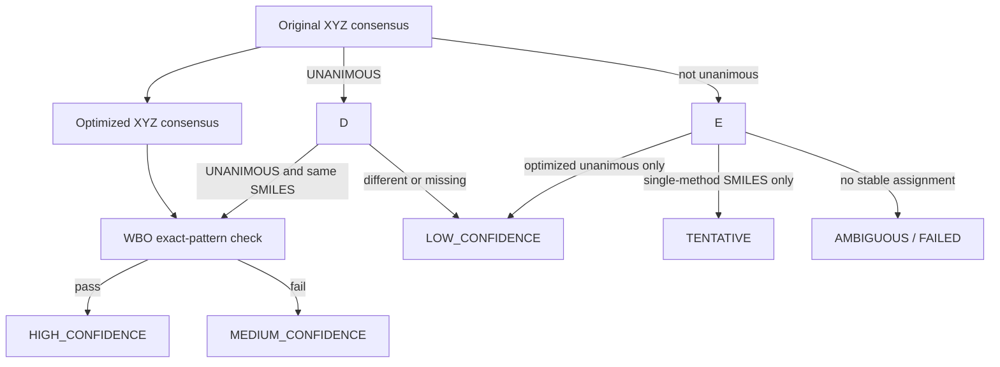
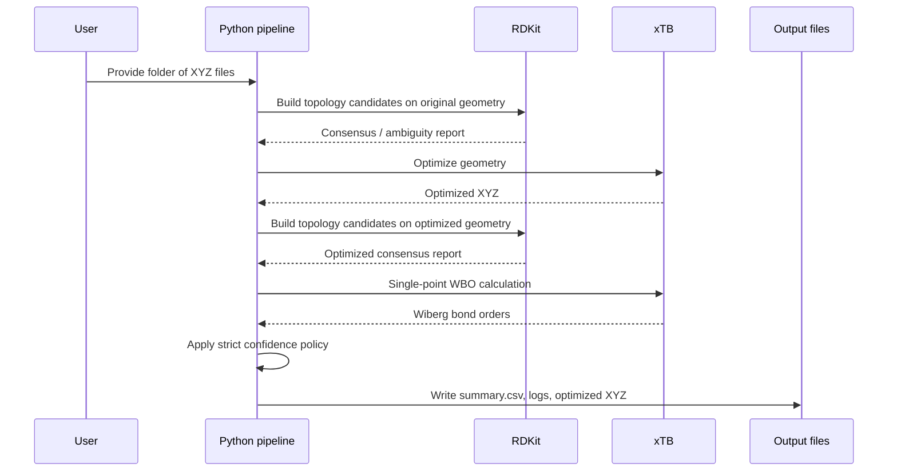

# Conservative XYZ → Canonical SMILES via RDKit Consensus + xTB Wiberg Verification

<p align="center">
  
  
  
  
  
</p>

> **Companion repository for a paper / methods publication** on conservative molecular graph recovery from XYZ coordinates.
>
> **One-line summary:** this code converts `.xyz` geometries into **canonical isomeric SMILES** using a deliberately strict decision policy that combines **multiple RDKit topology construction strategies**, **xTB geometry refinement**, and **exact-pattern Wiberg bond-order verification**.

---

## Why this repository exists

Recovering a chemically trustworthy molecular graph from an XYZ geometry is not always straightforward. Small geometric distortions, ambiguous bond orders, aromaticity edge cases, or method-specific topology choices can lead to unstable or incorrect SMILES assignments.

This repository implements a **conservative acceptance pipeline** designed for **publication-grade traceability**:

- it generates candidate topologies using **multiple independent RDKit procedures**,
- requires **unanimous agreement** before accepting a structure as high confidence,
- checks whether the topology is stable **before and after xTB optimization**, and
- verifies that **xTB Wiberg bond orders support the same bonded pairs and inferred bond-order pattern**.

The result is not a maximally permissive converter. It is a **high-specificity screening pipeline** intended for datasets, benchmarks, supplementary methods, or reproducible cheminformatics workflows.

---

## Graphical abstract

```mermaid
flowchart LR
    A[Input XYZ] --> B[Normalize and validate XYZ]
    B --> C[RDKit multi-method topology generation\n(original geometry)]
    C --> D[xTB geometry optimization]
    D --> E[RDKit multi-method topology generation\n(optimized geometry)]
    D --> F[xTB Wiberg bond orders]
    E --> G{Unanimous consensus\non both geometries?}
    F --> H{Exact bond-pattern\nsupported by WBO?}
    G -->|Yes| H
    G -->|No| I[Lower confidence / ambiguous]
    H -->|Yes| J[HIGH_CONFIDENCE SMILES]
    H -->|No| K[MEDIUM / LOW / TENTATIVE]
```

---

## Highlights

- **Consensus-first design** rather than single-method assignment.
- **Cross-geometry validation** using both original and xTB-optimized coordinates.
- **Strict WBO gate** based on **discrete bond-class matching**, not loose interval overlap.
- **Explicit aromatic-ring handling** for aromatic bond verification.
- **Traceable outputs** with per-molecule logs, optimized XYZ files, and a machine-readable summary CSV.
- **Parallel execution** with threading designed to avoid common Windows RDKit/MKL multiprocessing failures.

---

## Method overview

### 1) Multi-method RDKit topology generation

For each XYZ geometry, the script tries several independent RDKit pathways, including:

- `DetermineBonds_ctd`
- `DetermineBonds_covF_1.25`
- `Connectivity_ctd_then_BondOrders`
- `Connectivity_covF_1.25_then_BondOrders`
- optional VdW-based variants when supported by the RDKit build
- optional Hückel-based variants when available

Each successful method produces a candidate containing:

- canonical isomeric SMILES,
- formal charge,
- radical electron count,
- full explicit-H bond list,
- aromatic bond and aromatic-ring metadata.

### 2) Unanimous-agreement rule

A geometry is only considered **unanimous** when:

- at least **two independent RDKit methods** succeed,
- **all attempted methods** succeed, and
- all successful methods return the **same canonical SMILES**.

### 3) xTB refinement

The script performs xTB optimization and then a separate xTB single-point calculation for Wiberg bond orders:

- **geometry optimization:** defaults to **GFN-FF**
- **WBO evaluation:** defaults to **GFN2-xTB** single-point with `--wbo`

This separation is intentional: the code comments indicate that the chosen default avoids known issues with certain optimization paths while still keeping the bond-order check electronically informed.

### 4) Exact-pattern Wiberg verification

The WBO check is intentionally strict:

- every RDKit bond must have xTB WBO support,
- aromatic ring systems are checked explicitly,
- non-aromatic bonds are mapped into **discrete classes** (`SINGLE`, `DOUBLE`, `TRIPLE`, `NONBOND`, `AMBIGUOUS`),
- the xTB-inferred pattern must match the unanimous optimized RDKit topology **bond by bond**, and
- strong xTB-supported non-RDKit bonds are rejected.

---

## Confidence ladder



### Output classes

| Status | Meaning |
|---|---|
| `HIGH_CONFIDENCE` | Original and optimized geometries both reach unanimous RDKit consensus, both agree on the same SMILES, and xTB WBO exact-pattern verification passes. |
| `MEDIUM_CONFIDENCE` | Original and optimized geometries agree unanimously on the same SMILES, but WBO exact-pattern verification does not pass. |
| `LOW_CONFIDENCE` | Only one geometry view reaches unanimous RDKit consensus. |
| `TENTATIVE` | A SMILES exists, but only from a weaker single-method outcome without multi-method consensus. |
| `AMBIGUOUS` | Conflicting or insufficient evidence for a reliable assignment. |
| `FAILED` | Invalid XYZ, xTB failure, or unrecoverable technical failure. |

---

## Repository layout

```text
.
├── xtb_rdkit_high_confidence_smiles_v3.py
├── README.md
├── environment.yml / requirements.txt        # recommended to add
├── data/
│   └── all/                                  # input XYZ files
├── results/
│   ├── summary.csv
│   ├── optimized_xyz/
│   └── logs/
└── paper/
    ├── manuscript.pdf                        # optional
    ├── supplementary_information.pdf         # optional
    └── figures/                              # optional
```

For a publication repository, it is worth keeping the **paper**, **supplementary material**, **example data**, and **generated outputs** clearly separated.

---

## Installation

### Requirements

- Python **3.10+**
- [RDKit](https://www.rdkit.org/)
- [xTB](https://github.com/grimme-lab/xtb)

### Example conda environment

```bash
conda create -n xyz2smiles python=3.10 -y
conda activate xyz2smiles
conda install -c conda-forge rdkit xtb -y
```

If you use this repository for a publication, consider freezing the exact software environment and committing either:

- `environment.yml`,
- `conda list --explicit` export, or
- a container recipe.

---

## Quick start

Run the full pipeline on a folder of XYZ files:

```bash
python xtb_rdkit_high_confidence_smiles_v3.py all -o xtb_rdkit_results
```

This matches the usage example documented in the script header.

### Default runtime settings

```text
--opt-method gfnff
--gfn 2
--acc 2.0
--cycles 2000
--scc-iterations 2500
--jobs 8   # actual default in code = half of CPU cores
```

### Common options

```bash
python xtb_rdkit_high_confidence_smiles_v3.py all \
  -o xtb_rdkit_results \
  --charge 0 \
  --opt-level normal \
  --opt-method gfnff \
  --gfn 2 \
  --acc 2.0 \
  --cycles 2000 \
  --scc-iterations 2500 \
  --jobs 8 \
  --xtb-threads 1 \
  --skip-existing
```

---

## End-to-end workflow



---

## Output files

### `summary.csv`

The summary table contains the main per-molecule decisions:

- `filename`
- `status`
- `canonical_smiles`
- `optimized_xyz`
- `reason`
- `original_successful_methods`
- `optimized_successful_methods`
- `original_consensus`
- `optimized_consensus`
- `wbo_check`

### `optimized_xyz/`

Contains the xTB-optimized geometry for each successfully optimized molecule.

### `logs/`

Contains the xTB stdout/stderr logs used for traceability and debugging.

---

## Reproducibility notes

This repository is especially suitable for a paper when accompanied by:

1. a fixed software environment,
2. a frozen set of input XYZ files,
3. archived outputs (`summary.csv`, logs, optimized geometries), and
4. a clear description of the decision policy used to classify structures.

### Suggested publication checklist

- [ ] Add the full paper title below the main heading.
- [ ] Add author names and affiliations.
- [ ] Add a DOI badge once available.
- [ ] Add `environment.yml` or container instructions.
- [ ] Archive benchmark inputs and final outputs.
- [ ] Add a `CITATION.cff` file.
- [ ] Add a software license.
- [ ] Link this repository in the paper’s methods or data-availability statement.

---

## Interpreting the design choices

A few design decisions in the script are worth highlighting in a manuscript:

- **Conservative rather than permissive behavior:** ambiguous cases are not forced into a single answer.
- **Multiple topology routes:** agreement across methods is treated as evidence of stability.
- **Original vs optimized geometry comparison:** this tests whether the inferred graph is robust to refinement.
- **Exact-pattern WBO validation:** this raises the bar above loose compatibility checks.
- **Windows-safe parallelism:** the workflow uses a thread-based outer scheduler because xTB dominates runtime and this avoids common process-based import crashes.

These are strong points to emphasize in a **Methods**, **Benchmarking**, or **Limitations** section.

---

## Example “How to cite this repository” section

### Citation for the paper

```bibtex
@article{yourpaper2026,
  title   = {Conservative XYZ-to-SMILES Assignment Using RDKit Consensus and xTB Wiberg Verification},
  author  = {Author One and Author Two and Author Three},
  journal = {Journal Name},
  year    = {2026},
  volume  = {xx},
  number  = {x},
  pages   = {xx--xx},
  doi     = {10.xxxx/your-doi}
}
```

### Citation for the code / repository

```bibtex
@software{yourrepo2026,
  author  = {Author One and Author Two},
  title   = {Conservative XYZ → Canonical SMILES via RDKit Consensus + xTB Wiberg Verification},
  year    = {2026},
  url     = {https://github.com/your-username/your-repo},
  version = {v1.0.0}
}
```

---

## Recommended files to add for a polished publication repo

To make the repository stand out on GitHub and look publication-ready, consider adding:

- `CITATION.cff`
- `LICENSE`
- `environment.yml`
- `paper/` with manuscript or preprint links
- `examples/` with 3–5 representative XYZ files
- `figures/` with benchmark or error-analysis plots
- GitHub Actions for environment smoke tests

A minimal `CITATION.cff` and `environment.yml` would improve discoverability immediately.

---

## Limitations

This pipeline is intentionally strict. That is a feature, but it also means:

- some chemically reasonable structures may still be classified as `AMBIGUOUS`,
- success depends on the quality and consistency of the input XYZ geometry,
- unusual bonding motifs may require domain-specific review, and
- WBO thresholds and aromaticity logic should be discussed explicitly in the paper if benchmark conclusions depend on them.

---

## License

Choose a license before publication. For academic code repositories, common choices include:

- `MIT`
- `BSD-3-Clause`
- `Apache-2.0`

Until a license is added, reuse conditions are unclear.

---

## Acknowledgments

This workflow builds on:

- **RDKit** for molecular topology inference and SMILES generation
- **xTB** for geometry refinement and Wiberg bond-order analysis

Please cite both upstream projects appropriately in any derivative publication.

---

## Maintainer note

This README is written in a **paper companion** style. To finish adapting it for your repository, replace:

- the title with your exact paper title,
- placeholder citation entries,
- the repository URL,
- and, if relevant, add links to the manuscript, preprint, supplementary data, or benchmark dataset.
